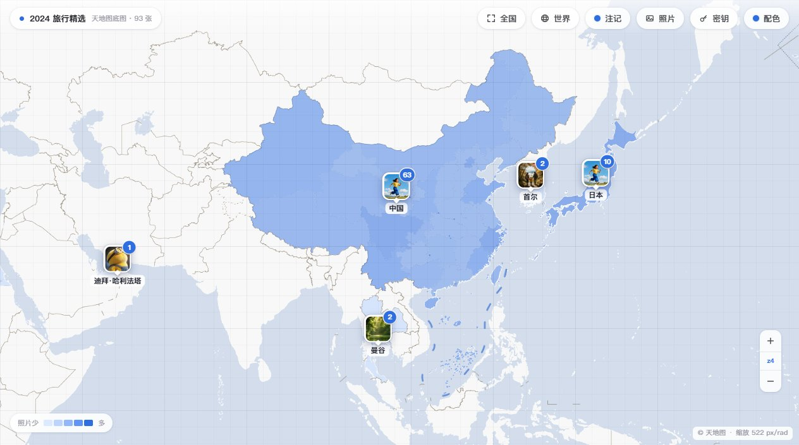
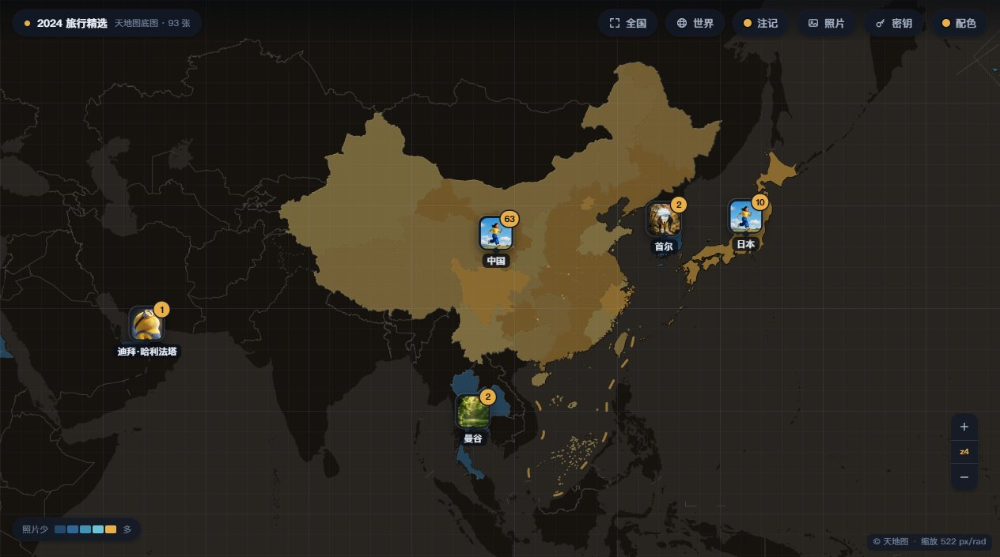
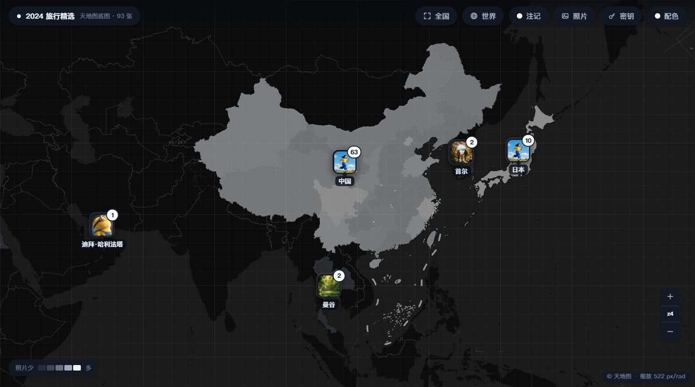
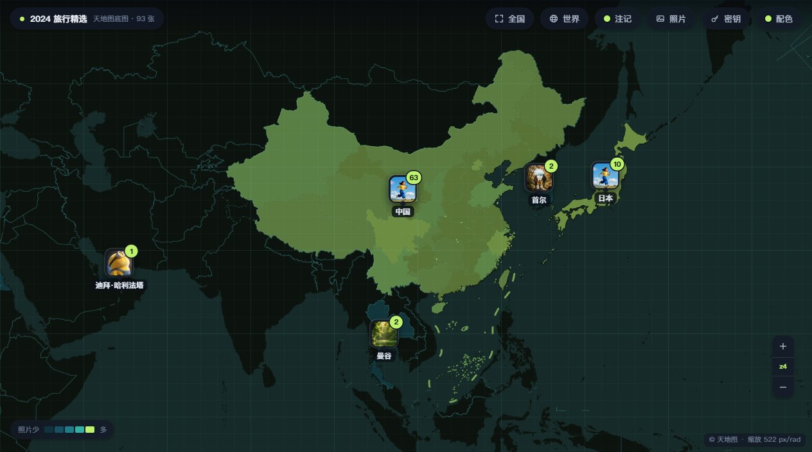
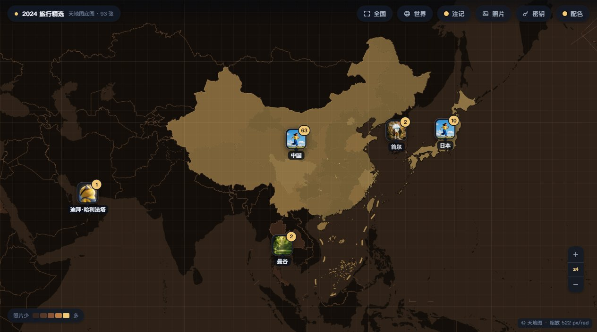

# PhotoMap — 相册地图（天地图免费底图）

把照片按 EXIF 的 GPS 落到天地图上：聚合散点、四级下钻、密度填色、五套配色，
零第三方依赖的自绘渲染引擎（聚合/标签/碰撞/动画全手写），纯静态站点。



## 运行

```bash
node tools/fetch-geo.js --tk=你的天地图密钥
                           # 首次运行前：拉取并生成本地边界数据（约 1 小时，幂等可续跑）
node tools/serve.js        # 自动挑端口、自动开浏览器
node tools/serve.js 8000   # 指定端口
```

或直接双击 `start.bat`（Windows）/ `start.command`（macOS）。

拉取边界数据需要一个天地图密钥（浏览器端 tk 即可，`--tk=` 或环境变量 `TDT_TK`）；
拉取期间偶发限流会自动退避重试，配额耗尽时次日重跑接着续。
在意县级边界细节、或想省掉配额的话，可用旧管线：
`node tools/fetch-geo.js --source=datav`（DataV GeoAtlas，无需密钥）。

打开后点右上角「密钥」，粘贴你的天地图浏览器端 tk 即可。
密钥只记在**本机** localStorage，不上传；`?nostore` 可整体停用落盘。

## 给老照片补坐标

老照片没有 GPS？`tools/inject-gps.js` 可以把坐标写进 JPEG 的 EXIF（零依赖）：

```bash
node tools/inject-gps.js IMG_001.jpg 34.0456 -118.2428 2025-10-01
# 可选 --out=输出.jpg（缺省原地覆盖）
```

手写 EXIF GPS 有四个字节级大坑：GPS 标签号错位（0x0003 是经度半球引用、
0x0004 才是经度）、半球引用漏写（'W' 不写坐标就落到东半球）、度分秒的
RATIONAL 数量写错（必须是 3 个，秒的换算是 ×60 不是 ×3600）、**TIFF 小端与
JPEG 段长度大端混用**（APP1 长度写错会把后面的图像数据全部"吞"进去，
整张图解码失败）。工具全部规避，写出的文件拖进导入功能即可落点。

导入解析器自带归因诊断：解析失败会区分「不是 JPEG / 有 EXIF 无 GPS /
GPS 越界 / 结构损坏」四种原因（`PhotoImport.probeExif`）——1000 张里只有
20 张有坐标时，第一反应不该是怀疑解析器坏了，先看失败原因分类。

## 视觉配色：五套主题，一条 filter 链

所有配色都是**整画布 CSS filter 链**：对天地图瓦片（连同密度填色层）整体做
色相/明度重映射，再叠一层极淡的色罩（veil）定色调。瓦片请求不变、照片色彩不受影响、
切换零重绘成本——换主题只是换一个 CSS 变量。

| 夜幕 night | 墨 ink | 深海 abyss | 陶土 clay | 纸白 paper |
| --- | --- | --- | --- | --- |
|  |  |  |  |  |

```css
/* 夜幕：反相把「浅底深线」翻成「深底浅线」，海陆关系反过来读更像深色主题 */
.app[data-theme='night'] { --tdt-filter: grayscale(1) invert(1) brightness(0.42) contrast(0.96); }
/* 深海：纯灰图上直接 saturate 无效——色彩要先被 sepia 造出来，再 hue-rotate 移相 */
.app[data-theme='abyss'] { --tdt-filter: grayscale(1) invert(1) brightness(0.40) sepia(1) hue-rotate(140deg) saturate(2.4); }
/* 纸白：唯一不反相的一档。天地图本就是浅底，降饱和+提亮即得「白陆地+淡蓝海域」 */
.app[data-theme='paper'] { --tdt-filter: saturate(0.42) brightness(1.12) contrast(0.94); }
```

**自定义配色**只需三行：在 `photo-map.css` 里加一个 `.app[data-theme='你的名字']`
块，写一条 `--tdt-filter` 链（可选 `--tdt-veil` 色罩），启动时 `?theme=你的名字`
即可启用。密度填色的五档色标也是同层变量（`--m-d1`…`--m-d5`，外加强调色
`--m-accent`），引擎按主题切换重读——每个主题的填色梯度各有一套。

## 动画：两条指数趋近，三条护栏

**缩放**（滚轮/双击/双指）走**对数域指数趋近**：`k` 的时间常数 85ms
（`1 - exp(-dt/85)`），tx/ty 不独立插值、由 k 与锚点反推——这一条是缩放锚点
漂移能做到 **0.00px** 的原因（`tools/probe-tiles.js` 有判据）。动画期间有配额
闸门：瓦片只按**终点视野**请求，途中不补帧。

**聚合散开**对簇的**世界坐标**（不是屏幕坐标）做指数趋近（105ms，收敛后吸附
到精确值——指数永不精确到达，悬着误差会累积）。散开方向有三条护栏：

1. **方向同向**——成员散开的方位角不允许各奔东西；
2. **锚点取像素实际落点**——动画起点按渲染像素反推，不从数据坐标直推；
3. **单位除数只落 sdx**——屏幕密度换算只进一个除数，避免双重换算抖动。

**照片 pin 是固定点**：定位准确与数量精准是红线。碰撞只藏名、绝不挪位，
分堆锚点恒为首张照片，聚合散开不改变落点——守恒由 `__tdt.conservation()`
随时可查（`tools/probe-photos.js`）。

## 核心设计

- **单相机**：整个引擎只有一份 `{lng, lat, k}` 状态，拖动/缩放/锚点全部由它推导。
- **全球一致的破簇时机**：聚合单位在 t≥0.5 时中国按省、境外按城市切换——
  所有国家的国家簇在**同一帧**按同一规则散开，缩放下钻的手感不因国界而异；
  境外没有 admin-1 边界数据，城市单位取自照片的地点名，不引入任何境外画法。
- **聚合三道键**：`regionKey`（跨国不合并）→ `unitOf`（同一阈值 0.5 同时决定
  hover/填色/聚合/标签粒度）→ 收单簇（国家级只收一簇）。地点拆分以「离堆心距离」
  为闸门且经度乘 cos(lat) 修正——名字相同不等于在同一地方。
- **标签四级**：国家 / 省 / 市 / 县四级标注不设缩放阈值，省名仅在低聚合粒度出现；
  碰撞只藏名不挪位。
- **底图静态整块缓存**：拖动只挂整设备像素 `translate3d`，重锚走条带补图，
  缩放不重画（闸门 `|log2 s| ≤ 0.25` + coverage + 版本未变）——一帧画布成本
  ≈ 面积 × 是否写像素。

## 探针（tools/）

零依赖（Node 22 自带 WebSocket），全部判据落在「页面解算出来的结果」上，
不落在「字符串怎么写」上：`probe-tiles.js`（锚点漂移/瓦片对位）、`probe-fill.js`
（密度填色 + 市界归属）、`probe-labels.js`（四级标签碰撞）、`probe-anim.js`
（缩放/散开动画）、`probe-photos.js`（pin 守恒）、`probe-key-web.js`（密钥三通道）、
`probe.js`（总入口）。跑法：先 `node tools/serve.js 8000`，再
`MAP_URL=http://127.0.0.1:8000 node tools/probe-fill.js`。
`node tools/shots.js` 可重新生成 README 的五张主题截图。

## 目录结构

```
photomap-tdt/
├── index.html            # 入口（自包含）
├── photo-map.css / tdt-extra.css / topbar-fit.js
├── photo-data.js         # 演示数据（全虚构，零隐私）
├── photo-store.js / photo-import.js
├── tdt-map.js            # 渲染引擎（单相机 / 聚合 / 标签 / 动画）
├── start.bat / start.command   # 一键启动（Win / macOS）
├── assets/
│   ├── shots/            # README 主题截图（tools/shots.js 生成）
│   ├── geo/              # 边界数据（fetch-geo.js 本地生成，不入库；
│   │                     #   jiuduanxian.js 十段线随库分发）
│   └── photo-*.webp      # 18 张演示照片
└── tools/
    ├── fetch-geo.js      # 边界数据管线（天地图 V2.0 默认源；--source=datav 为反向缝）
    ├── inject-gps.js     # EXIF GPS 注入（零依赖；四个字节级坑的规避见上）
    ├── serve.js / server.py    # 静态服务（Node 首选 / Python 兜底）
    ├── shots.js          # 五主题截图生成（headless Chrome + CDP）
    ├── world-zh.json     # 238 国中文名映射
    ├── lib/cdp.js        # 零依赖 CDP 客户端
    └── probe-*.js        # 探针（判据链见上）
```

## 数据来源与合规

- **中国边界（省/市/区县）**：[天地图·行政区划 V2.0](https://lbs.tianditu.gov.cn/server/administrative2.html)
  官方权威数据（CGCS2000 ≈ WGS-84，文件带 `crs:"wgs"` 标记，引擎据此免偏移转换）。
  34 个省级要素的环并集即标准国界轮廓——本项目渲染中国**只用**这套省级标准数据，
  不使用任何境外来源的中国边界画法。
- **世界国别**：Natural Earth 50m（world-atlas 发行版）。已剔除中国/台湾/香港/澳门四要素，
  避免境外数据源的中国画法进入渲染。
- **九段线**：`assets/geo/jiuduanxian.js` 随库分发（十段，与 2023 年版标准地图一致），
  供密度填色层完整点亮南海诸岛。
- **拉取发生在使用者本机**：仓库不存储、不分发任何边界坐标数据（十段线除外）；
  `fetch-geo.js` 幂等可重复执行。
- 精度取舍：省级边界点数约为 DataV 版 3 倍；县级为官方简化轮廓（粗 2–8 倍），
  换取权威与合规，`--source=datav` 可换回细县级。

## License

MIT — 见 [LICENSE](LICENSE)。
